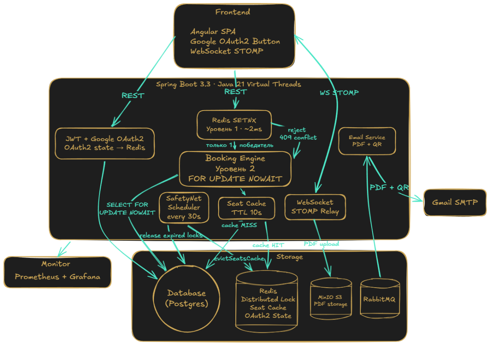

<a id="top"></a>
<div align="center">

<!-- Animated typing header -->


<br/>

<h1 align="center"><a href="#top"> </a></h1>

> *"When you understand how a system works — you start seeing structure in everything."*

<br/>

[](https://t.me/JayceWright)
[](https://jaycewright.github.io)
[](mailto:prog061204@gmail.com)


</div>

---

## `$ whoami`

```yaml
name:     Jayce Wright (Azizbek Ismoilov)
role:     Backend Engineer
stack:    Java 21 · Spring Boot · PostgreSQL · Redis · Docker · k6
focus:    High-load systems, fault-tolerant APIs, distributed architectures
status:   Open to internships & full-time roles
location: Russia · Ready to relocate
```

I don't just write code that works — I write code that holds under pressure.  
My benchmark is **1000 concurrent users**, not 1.

---

## `$ cat achievements.log`

🏆 **Kod Sporta — Winner** `T-Bank 2026`  
&nbsp;&nbsp;&nbsp;&nbsp;Team Competitive Programming Contest. Team of 3. Work under pressure, won under pressure.

🏦 **Backend Lead** `T-Bank × HSE Practicum 2026`  
&nbsp;&nbsp;&nbsp;&nbsp;Led a 5-person team for 10 weeks (600+ hours). Public defence before T-Bank && HSE jury.  
&nbsp;&nbsp;&nbsp;&nbsp;**58 PRs · 222+ commits · Full CI/CD pipeline built from scratch**

⚡ **1000 VU Load Test** `k6 · 0 errors · 0 double-bookings`  
&nbsp;&nbsp;&nbsp;&nbsp;avg 250ms · p95 465ms · 0 errors 5xx · 0 race conditions

---

## `$ cat projects/featured.md`

<table>
<tr>
<td width="60%">

### 🎫 [T-Reserve Engine](https://github.com/TicketRace/T-RESERVE-ENGINE)
`T-Bank × HSE · Production · Backend Lead`

High-load ticket booking system with **dual-layer race condition protection**:

- **Layer 1 — Redis SETNX** `~2ms fast-reject`  
  999 of 1000 concurrent requests rejected before touching the database
- **Layer 2 — PostgreSQL `SELECT FOR UPDATE NOWAIT`** `ACID source of truth`  
  1 winner gets the ticket. Zero double-bookings guaranteed.

**SafetyNet Scheduler** — auto-release expired locks every 30s via partial index scan  
**Graceful Degradation** — Redis failure → system falls back to PG-only, stays alive  
**WebSocket STOMP** — real-time seat map updates for all connected clients  
**RabbitMQ async pipeline** — PDF generation → MinIO → email delivery (non-blocking)

</td>
<td width="40%" align="center">

| Metric | Result |
|--------|--------|
| 🟢 Concurrent VUs | **1,000** |
| ⚡ Avg response | **250ms** |
| 📊 p95 latency | **465ms** |
| ❌ 5xx errors | **0** |
| 🎫 Double-bookings | **0** |
| 🔁 PRs merged | **58** |

</td>
</tr>
</table>

**Stack:** `Java 21` `Spring Boot 3.3` `PostgreSQL 16` `Redis 7` `RabbitMQ` `Docker` `Nginx` `Prometheus` `Grafana` `k6` `Testcontainers` `GitHub Actions`

### 🏛️ Architecture & Engineering Highlights
<div align="center">
  
</div>

---

## `$ cat stack.json`

```json
{
  "languages":   ["Java 21 (primary)", "Python", "SQL", "Bash"],
  "frameworks":  ["Spring Boot 3", "Spring Security", "Hibernate/JPA", "FastAPI"],
  "databases":   ["PostgreSQL 16", "Redis 7", "RabbitMQ"],
  "infra":       ["Docker", "Nginx", "GitHub Actions", "Linux", "Railway"],
  "monitoring":  ["Prometheus", "Grafana", "HikariCP metrics"],
  "testing":     ["k6", "JMeter", "JUnit 5", "Mockito", "Testcontainers"],
  "patterns":    ["Distributed Locking", "Circuit Breaker", "Graceful Degradation",
                  "State Machine", "Ports & Adapters"]
}
```

---

## `$ git log --stat`

<div align="center">

<a href="#stats"></a>
<a href="#stats"></a>

<br/><br/>

<a href="#stats"></a>

<br/><br/>

<a href="#stats"></a>

</div>

---

<div align="center">

```
[SYSTEM ONLINE] :: Backend that survives production. Architecture that scales.
```

**[jaycewright.github.io](https://jaycewright.github.io)** · Built by Jayce Wright · 2026

</div>
